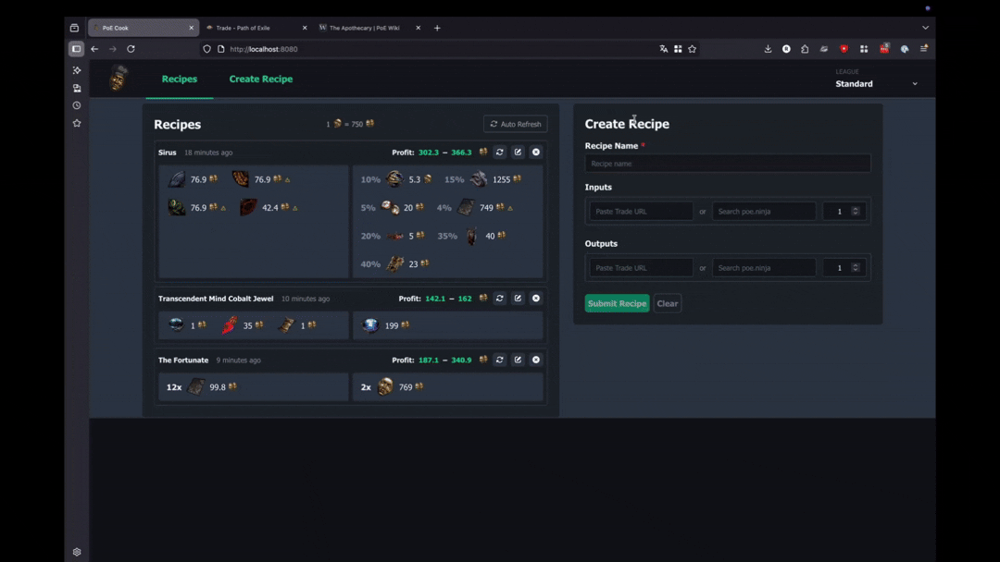
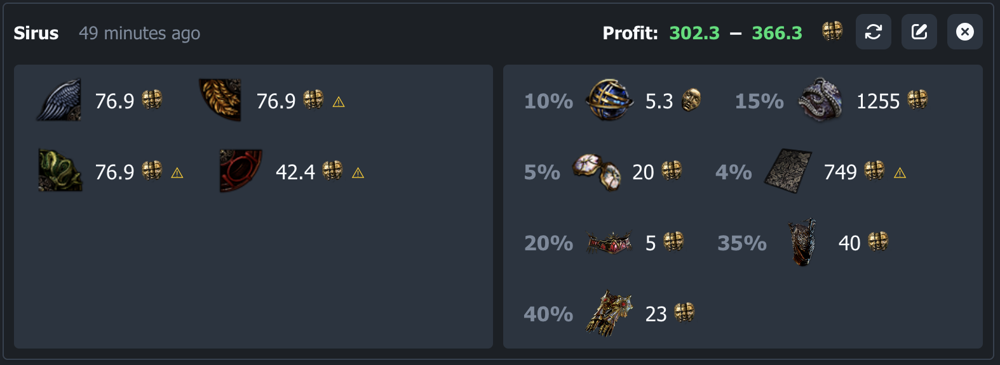
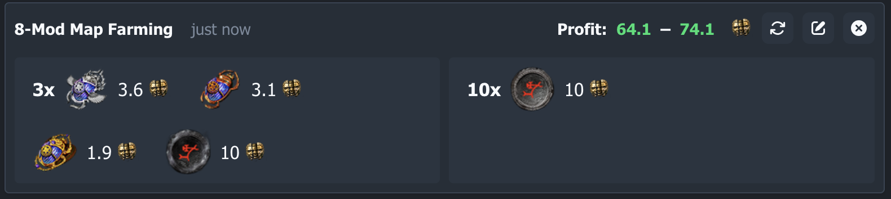
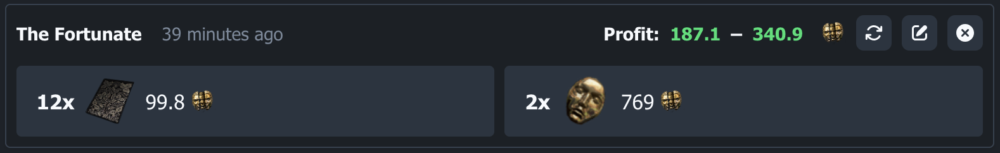
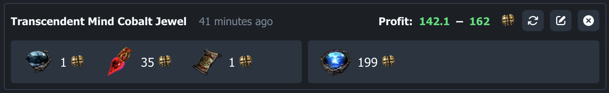
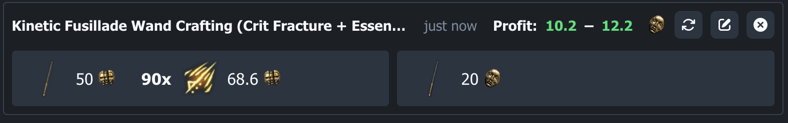
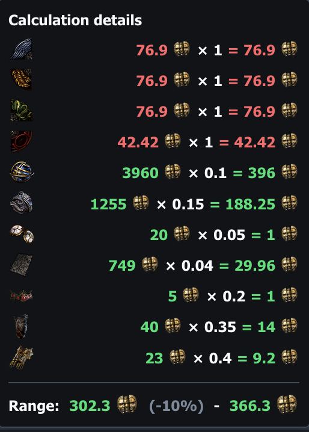
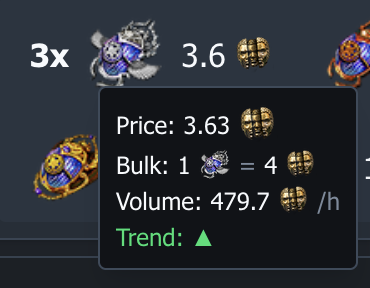
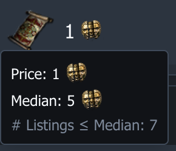

<h1>
  
  PoE Cook
</h1>

**Your strategy profit live tracker for Path of Exile.**

"Cooking" is the art of turning knowlegde into strategies that yield profit — whether that's flipping Divination cards, sacrificing items in Temples, running Bestiary recipes, farming bosses for drops, or crafting items to sell.

*PoE Cook* lets you define, evaluate, and track these strategies as recipes: specify your inputs, set your outputs, and see in real-time whether they are profitable — powered by live poe.ninja prices and direct trade listing lookups.

Defining a specifc item with the PoE trade website is as easy as it gets: just paste the trade URL, and PoE Cook will fetch the live listings and extract the item details for you. The price will be frequently updated based on your initial search, saving you the hassle of refreshing the trade site and manually checking your profit margins while you play.

> **Developer Alpha** — functional and usable locally with [Docker](#quick-start-docker), but rough edges remain. See the [Roadmap](#roadmap) for further plans.

---

## Showcase

This is a very early version of the app, but here are some highlights of what it can do already:




### Farming Bosses for Drops (Example: Sirus)


### Evaluating Scarab Strategies (Example: 8-Mod Map Farming)


### Flipping Divination Cards (Example: The Fortunate)


### Sacrificing items in the Temple (Example: Transcendent Mind)


### Crafting and selling items (Example: Kinetic Fusillade Wand)


### Breakdown of profit calculation:  


### Bulk Item Details from poe.ninja:  


### Trade Search Listing overview: 



---

## Contents

- [Features](#features)
- [Prerequisites](#prerequisites)
- [Quick Start (Docker)](#quick-start-docker)
- [Getting your POESESSID](#getting-your-poesessid)
- [Available Commands](#available-commands)
- [Local Development (without Docker)](#local-development-without-docker)
- [Project Structure](#project-structure)
- [Running Tests](#running-tests)
- [API & Code Generation](#api--code-generation)
- [FAQ](#faq)
- [Roadmap](#roadmap)
- [Contributing](#contributing)

---

## Features

- **Recipe builder** — define any strategy as a recipe: N input items → M output items, each with a configurable quantity. Works for currency flipping, Div card sets, Bestiary recipes, Temple sacrifices, boss drops, crafting, and more
- **Live profit calculation** — compares the chaos-equivalent cost of all inputs vs. the value of the outputs using real-time poe.ninja exchange rates
- **Trade page resolver** — paste any Path of Exile trade URL; PoE Cook fetches the live listings and extracts item details automatically (requires a valid `POESESSID`)
- **Multi-league support** — switch between leagues; all prices update instantly
- **Auto-refresh** — background scheduler keeps recipe values current while you play, so you always know which strategies are worth running
- **poe.ninja integration** — currency and item prices fetched and cached from poe.ninja
- **Travel to Hideout with a Click** — quickly navigate to the cheapest list ing for any recipe output directly from the app

---

## Prerequisites

### Docker path (recommended)
- [Docker Desktop](https://www.docker.com/products/docker-desktop/) (or Docker Engine + Compose plugin)

### Local dev path
- Node.js 22+ and npm 10+

---

## Quick Start (Docker)

**1. Clone the repository**
```bash
git clone https://github.com/rbiersbach/poe-cook.git
cd poe-cook
```

**2. Configure your session ID**
```bash
cp .env.example .env
```
Open `.env` and replace `your_session_id_here` with your actual `POESESSID`.  
→ See [Getting your POESESSID](#getting-your-poesessid) if you're not sure where to find it.

> **Session ID** is needed to resolve trade urls to search parameters, I found no better way to do this for now.

**3. Start the app**
```bash
make start
```

This builds the Docker images and starts both services. Once complete:

| Service  | URL                        |
|----------|----------------------------|
| App      | http://localhost:8080      |
| API      | http://localhost:3001      |

> **First run** takes a minute or two to build the images. Subsequent starts are fast.

---

## Getting your POESESSID

POE Tools needs your Path of Exile session cookie to fetch trade listings on your behalf, because opening a trade link and deriving the search parameters from there requires authentication.

1. Open [pathofexile.com](https://www.pathofexile.com) and **log in**
2. Open your browser's DevTools (`F12` / `Cmd+Option+I`)
3. Go to **Application** (Chrome) or **Storage** (Firefox) → **Cookies** → `https://www.pathofexile.com`
4. Find the cookie named **`POESESSID`** and copy its value
5. Paste it as the value of `POE_SESSID` in your `.env` file

> **Note:** the session cookie expires when you log out of the Path of Exile website. If recipe resolution stops working, refresh the cookie by logging in again and repeating the steps above.
Sharing a session cookie with a third party app is not recommended and should be avoided.
A final version of this app should find a better solution.
If you are afraid of running my code, check first that its safe.

---

## Available Commands

```bash
make start     # Build images and start all services
make stop      # Stop and remove containers
make restart   # Stop then start
make build     # Rebuild Docker images without starting
make logs      # Follow logs from all containers
make dev       # Print local development instructions
make help      # List all commands
```

---

## Local Development (without Docker)

```bash
# 1. Install all workspace dependencies
npm install

# 2. Create your .env file (required — backend reads POE_SESSID from it)
cp .env.example .env
# Edit .env and set POE_SESSID

# 3. Start the backend (port 3001) — in one terminal
npm run dev:backend

# 4. Start the frontend (port 5173) — in another terminal
npm run dev:frontend
```

Open http://localhost:5173 in your browser.

---

## Project Structure

```
poe-cook/
├── backend/                  # Fastify API server (Node.js + TypeScript)
│   ├── src/
│   │   ├── api/              # Route handlers
│   │   ├── models/           # Shared types
│   │   ├── services/         # Business logic (trade resolver, poe.ninja, recipes…)
│   │   ├── stores/           # In-memory data stores
│   │   └── index.ts          # Entry point
│   └── data/
│       └── recipes.json      # Persisted recipe data (mounted as Docker volume)
│
├── frontend/                 # React + Vite + Tailwind app
│   └── src/
│       ├── api/generated/    # Auto-generated API client (from OpenAPI spec)
│       ├── components/       # Reusable UI components
│       ├── pages/            # Page-level components (RecipesList, CreateRecipe)
│       └── context/          # React context (league, exchange rates, …)
│
├── specs/
│   └── openapi.yaml          # OpenAPI 3.0 spec (source of truth for the API)
│
├── docker-compose.yml        # Orchestrates backend + frontend containers
├── Makefile                  # Developer shortcuts
└── .env.example              # Environment variable template
```

---

## Running Tests

```bash
# Backend tests
npm run test --workspace backend

# Frontend tests
npm run test --workspace frontend
```

---

## API & Code Generation

The frontend API client is generated from the OpenAPI spec in `specs/openapi.yaml`.

After changing the spec or the backend API, regenerate the client:
```bash
npm run generate:api
```

The generated files land in `frontend/src/api/generated/` — do not edit them manually.

---

## FAQ

**Why do you need my PoE Session ID?**

The session ID is not strictly required to use the trade search API, but it is needed to open an existing Trade URL and extract the search parameters from it. Without an active session, that lookup will be blocked by the trade site. If you know a better way to achieve this without a session, please reach out!

**Why isn't this available as a hosted website?**

This project started not too long ago as a personal side project. A hosted version is something I'll consider if there is enough interest. That said, the session ID requirement (see above) also complicates hosting, since users would still need to supply their own credentials.

**Why is refreshing items so slow?**

The PoE trade API enforces a rate limit of 5 requests per 5 seconds. If you prefer not to babysit the refresh button, enable **Auto Refresh** — it will automatically work through your recipe list at a safe pace without triggering throttling.

**I'm getting rate-limit errors while using PoE Cook alongside the trade site.**

This is expected behaviour. When both the app and the trade site fire requests at the same time, they share the same rate-limit budget. If this becomes disruptive, try turning off Auto Refresh while you are actively browsing the trade site.

**Some poe.ninja items can't be found in the search.**

This is a known limitation. Certain item types — especially uniques — are difficult to price reliably from ninja data alone due to variance in rolls and implicit mods. For now the item search is focused on bulk currencies, and you can always paste a trade URL directly for anything else. Support for more item types may be added in the future.

**Why does the frontend look rough around the edges?**

Fair point — I'm primarily a backend developer and picked this project partly to learn more React and TypeScript. Polish is ongoing, and all tips, suggestions, and pull requests are genuinely welcome!

---

## Roadmap

### Planned for next releases

- [ ] Initial set of pre-built recipes to get started without creating everything from scratch
- [ ] Custom price overrides per item

### Future / Backlog
- [ ] Import more items from PoE Ninja e.g. Uniques
- [ ] Tag recipes and show/hide groups
- [ ] Filter recipes
- [ ] Favourite recipes
- [ ] Read-only predefined core recipes with persisted refresh results
- [ ] Browser-based login / PoE OAuth (remove the need to copy POESESSID manually)
- [ ] Database persistence (replace the JSON file store)
- [ ] User accounts and cloud sync
- [ ] Hosted version (no local setup required)
- [ ] IP rate limiting and abuse protection
- [ ] Migrate recipes to a different league
- [ ] Baseline currency toggle (e.g. price everything in Divine instead of Chaos)


---

## Contributing

1. Fork the repo and create a feature branch (`git checkout -b feat/my-feature`)
2. Make your changes — run the tests before pushing (`npm run test --workspace backend && npm run test --workspace frontend`)
3. Open a pull request against `main` with a clear description of what changed and why

All feedback, bug reports, and suggestions are welcome via GitHub Issues.

---

*PoE Cook is an unofficial fan project. Not affiliated with or endorsed by Grinding Gear Games.*
